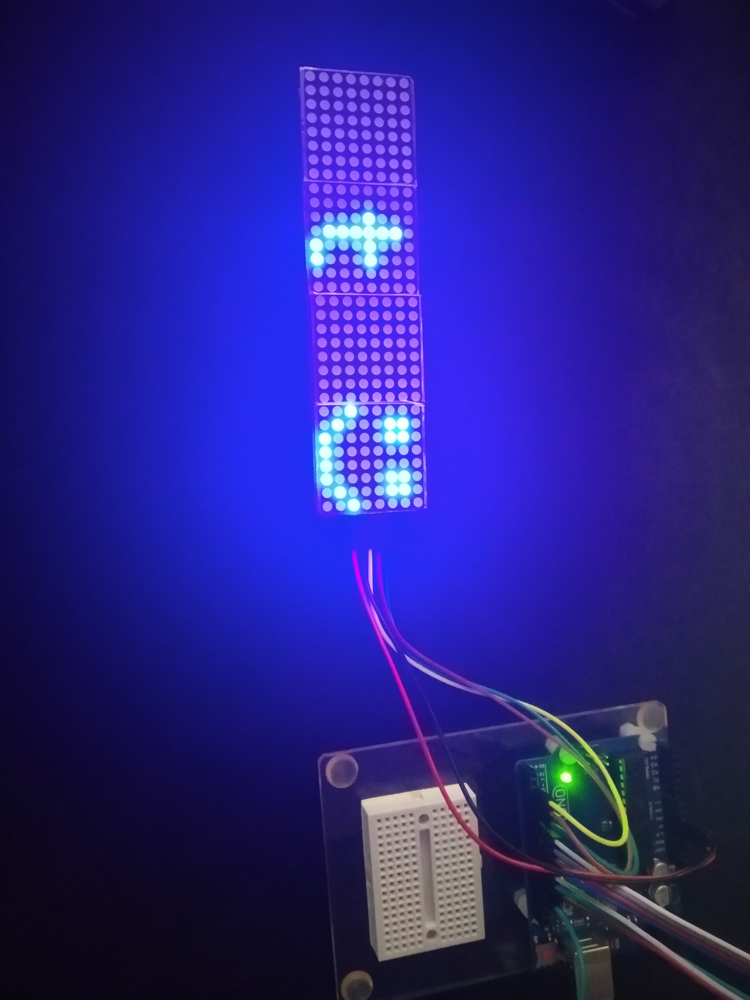

# Arduino afficheur matrice led par contrôle bluetooth
Un afficheur matrice de 8x32 LEDS contrôlé par une application mobile avec une liaison bluetooth à l'arduino
---

---
Schéma de montage avec un Arduino UNO, [Matrice Led MAX7219](https://fr.aliexpress.com/item/32620800331.html?channel=twinner).
